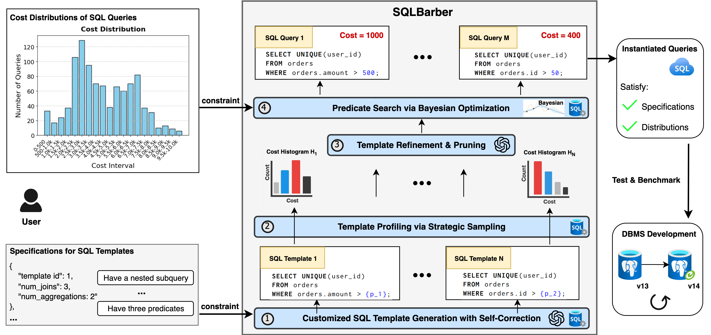
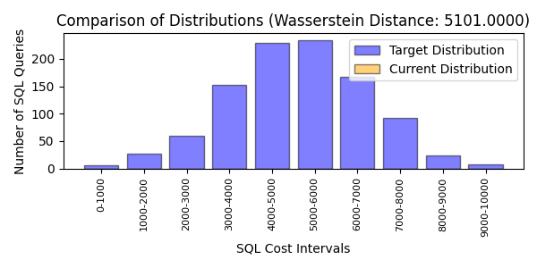
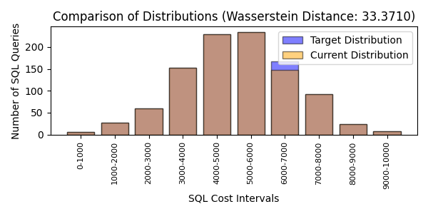
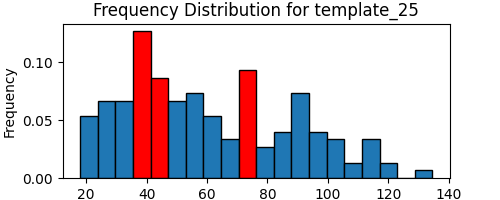
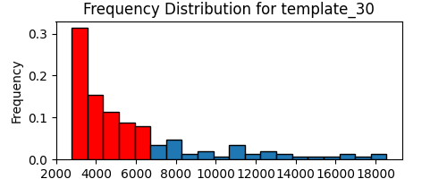
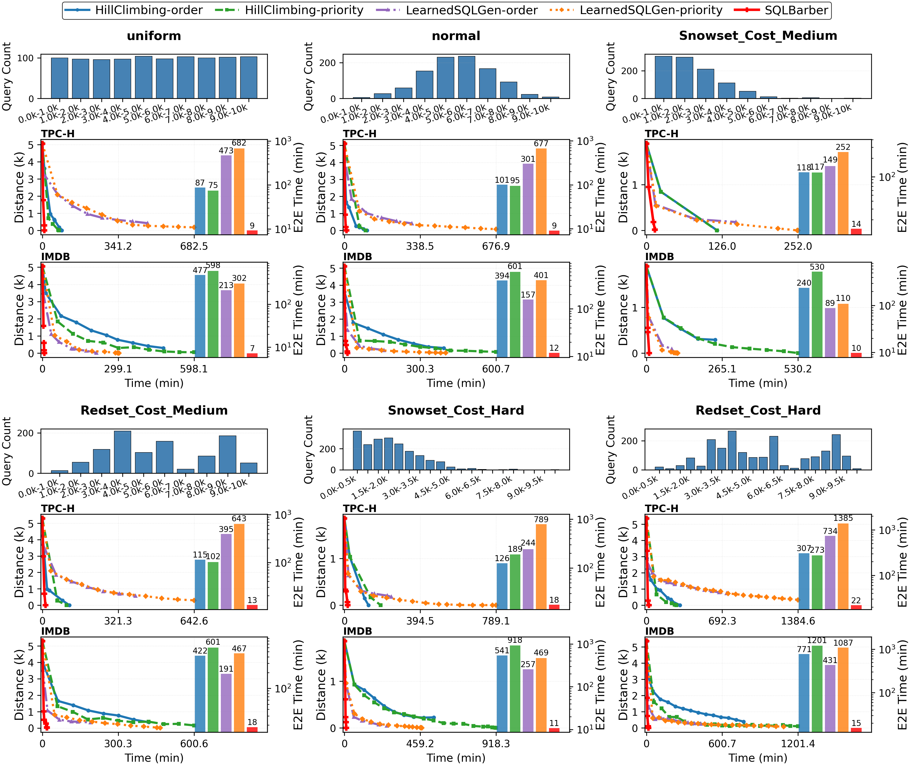

# SQLBarber: Leverageing Large Language Models Generate Customized and Realistic SQL Workloads (SIGMOD 2026)

- This repository hosts the source code and supplementary materials for:
    - [SIGMOD 2026](https://arxiv.org/abs/2507.06192) submission (accepted)
    - [SIGMOD Demo 2025](https://dl.acm.org/doi/10.1145/3722212.3725101) submission (accepted)

## Motivation
Database research and development often require a large number of SQL queries for benchmarking purposes. However, acquiring real-world SQL queries is challenging due to privacy concerns, and existing generation methods offer limited options for customization and for satisfying realistic constraints. 

SQLBarber focuses on producing a set of SQL queries that are either tailored to evaluate specific DBMS features or designed to closely reflect a given production SQL workload:
- Customized Workload. For example, benchmarking business intelligence systems such as [Tableau](https://dl.acm.org/doi/10.1145/3209950.3209952) requires SQL queries with structurally simple relational operator trees but highly complex scalar expressions, which is **not supported by any existing benchmark**. For query optimization, we may want to scale not only in the size of the database, but also scale in the complexity of queries (e.g., the number of joins, aggregations, and complex filter predicates).
- Realistic Workload. Leading companies such as Amazon and Snowflake have recently released workload statistics to facilitate the construction of realistic benchmarks ([Snowset](https://github.com/resource-disaggregation/snowset) from Snowflake and [Redset](https://github.com/amazon-science/redset) from Amazon Redshift). However, due to privacy constraints, the actual queries and underlying databases are unavailable; only high-level workload characteristics are shared. **SQLBarber can transform such high-level workload information into realistic and executable benchmarks.**
- Training Queries. Many learned DBMS components require a large number of queries to train their models, and these queries should be diverse to cover different features and complexities. For example, we can generate queries acessing different tables with different join paths. **Existing generation methods can not scale well to generate large volumes of queries that satisfy user-provided requirements.**

## System Overview


**SQLBarber** is a system based on Large Language Models (LLMs) to generate customized and realistic SQL workloads. The figure above presents the workflow:
- 📌 Input: users provide the natural language specifications to constrain the SQL templates, and the cost distribution (e.g., cardinality, execution cost) to constrain the instantiated queries
- 📌 ① SQLBarber employs an LLM-powered SQL Template Generator to create customized SQL templates based on user-defined template specifications
- 📌 ② SQLBarber uses profiling to evaluate the capability of each SQL template to produce queries of different costs
- 📌 ③ SQLBarber leverages profiling results to refine the created SQL templates to produce new templates that cover cost ranges not represented by the original templates, and prune templates that do not contribute to the target cost distribution
- 📌 ④ SQLBarber uses an adaptive Bayesian Optimization (BO)-based predicate search algorithm to efficiently search the predicate value space, and identify a set of queries that satisfy the target cost distribution
- 📌 Output: SQLBarber outputs an SQL workload where the underlying SQL templates satisfy the specifications and the instantiated queries match the target cost distribution

## Getting Started
Following commands are tested on PostgreSQL v14.9 in a docker container:

### Step 1: Install PostgreSQL
```
sudo apt-get update
sudo apt-get install postgresql-14
```

### Step 2: Prepare Databases

#### TPC-H Preparation
You can use our script to install [BenchBase](https://github.com/cmu-db/benchbase) and download the TPC-H database


- Note: the script is tested on `openjdk version "17.0.8.1" 2023-08-24`, (you may need to update openjdk to `version 21` to keep in pace with the newest benchbase), please prepare your JAVA environment first
```
cd ./scripts
sh install_benchbase.sh postgres
```
- Note: modify `./benchbase/target/benchbase-postgres/config/postgres/sample_{your_target_benchmark}_config.xml` to customize your database settings
```
sh build_benchmark.sh postgres tpch
```

#### IMDB Preparation
You can use the following commands to download and create the IMDB database
```
# 1  download the ready-made binary dump
wget -O imdb_job.dump https://doi.org/10.7910/DVN/2QYZBT

# 2  create an empty database and restore
createdb imdb
pg_restore -j 8 -Fd -d imdb imdb_job.dump     # -j uses 8 CPUs

# 3  (analyze & quit)
psql -d imdb -c 'ANALYZE VERBOSE;'
```

### Step 3: Install dependencies
```
sudo pip install -r requirements.txt
```

### Step 4: Use SQLBarber to generate an SQL workload
Before generating queries using SQLBarber, please make sure that `outputs/intermediate/db_meta_info/dbms_db` folder is empty, such that SQLBarber can extract latest statistics of your database (otherwise the optimization would be guided by incorrect information). This can take some time depending on the size of your database, and this only need to be done for one time.

The basic command to run SQLBarber is as follows:
```
# python3 src/run_sqlbarber.py <query_cost_type> <cost_distribution> <num_queries> <min_cost> <max_cost> <num_intervals> <num_iterations> <target_database> 
python3 src/run_sqlbarber.py cost uniform 1000 0 10000 10 100 imdb
```
Or you can directly use our scripts to reproduce all the experimental results:
```
cd ./scripts
./run_sqlbarber_main.sh
./run_sqlbarber_scalability.sh
```

### Step 5: View the generation process and results
We have visualized results for the generation process and elegant output results stored in the `outputs` folder. 
- `outputs/`
    - `final/`
        - `sql_template`: the generated SQL templates
            <details>
            
            <summary>Example</summary>

            ```
            -- Refined SQL Template Metadata
            -- Refinement Time: 2025-07-22 03:05:09
            -- Operation: both
            -- Old Join Path: movie_info m -> title t -> cast_info c -> role_type r -> movie_companies mc -> company_name cn -> movie_info m2
            -- New Join Path: company_name cn -> movie_companies mc -> movie_info m -> title t -> cast_info c -> role_type r -> movie_info m2
            -- Table Size Changes: Reordered the joins to start with the smaller company_name (29 MB) and movie_companies (282 MB) before joining the larger tables (movie_info ~1831 MB, cast_info ~3881 MB) to reduce the scanned rows early.
            -- Structural Changes: Added an extra predicate on cast_info (c.nr_order = '{{cast_info.nr_order}}') and refined the nested query by including a predicate on movie_companies (mc2.company_type_id = '{{movie_companies.company_type_id}}') to increase selectivity.
            -- LLM Reasoning: To push the execution cost into the target range [4000.0, 5000.0], I both re-ordered the join path and added more selective filters. Starting from a smaller table minimizes the intermediate result set and applying selective predicates on high-cardinality tables reduces overall cost. These changes, while retaining the required tables and structure including the nested aggregated subquery, aim to curtail the cost significantly.
            -- SQL Template Metadata
            -- Template ID: 20 Refined
            -- Creation Time: 2025-07-22 02:58:48
            -- LLM Model: o3-mini
            -- Constraints:
            --   Number of unique Tables Accessed: 6
            --   Number of Joins: 6
            --   Number of Aggregations: 5
            --   Semantic Requirement: The query should have a nested query with aggregation, at least two predicate values to fill.
            --   Tables Involved: [movie_info, title, cast_info, role_type, movie_companies, company_name]

            SELECT m.movie_id,
                COUNT(c.id) AS cast_info_count, -- Aggregation 1
            MIN(t.production_year) AS min_production_year, -- Aggregation 2
            MAX(t.production_year) AS max_production_year, -- Aggregation 3
            AVG(r.id) AS avg_role_id, -- Aggregation 4

            (SELECT SUM(mc2.company_id) -- Aggregation 5 via nested query

            FROM movie_companies mc2
            WHERE mc2.movie_id = m.movie_id
                AND mc2.company_type_id = '{{movie_companies.company_type_id}}') AS nested_sum_company_id
            FROM company_name cn
            JOIN movie_companies mc ON cn.id = mc.company_id
            JOIN movie_info m ON m.movie_id = mc.movie_id
            JOIN title t ON m.movie_id = t.id
            JOIN cast_info c ON m.movie_id = c.movie_id
            JOIN role_type r ON c.role_id = r.id
            JOIN movie_info m2 ON m.movie_id = m2.movie_id
            WHERE m.movie_id >= '{{movie_info.movie_id_start}}'
            AND m.movie_id <= '{{movie_info.movie_id_end}}'
            AND t.production_year = '{{title.production_year}}'
            AND c.nr_order = '{{cast_info.nr_order}}'
            GROUP BY m.movie_id;
            ```

            </details>
        - `task_name/`
            - `workload.json`: the generated SQL workload
                <details>
                <summary>Example </summary>

                ```
                [
                    {
                        "query_id": 1,
                        "template_id": 7,
                        "query": "SELECT\n  (SELECT COUNT(*)\n   FROM comp_cast_type\n   WHERE kind = 'crew') AS total_kind,\n       t.min_id,\n       t.max_id\nFROM\n  (SELECT MIN(id) AS min_id,\n          MAX(id) AS max_id\n   FROM comp_cast_type\n   WHERE id BETWEEN '1' AND '3') t;",
                        "cost_type": "cost",
                        "cost": 2.15
                    },
                    ...
                    {
                        "query_id": 4806,
                        "template_id": 20,
                        "query": "SELECT m.movie_id,\n       COUNT(c.id) AS cast_info_count, -- Aggregation 1\n MIN(t.production_year) AS min_production_year, -- Aggregation 2\n MAX(t.production_year) AS max_production_year, -- Aggregation 3\n AVG(r.id) AS avg_role_id, -- Aggregation 4\n\n  (SELECT SUM(mc2.company_id) -- Aggregation 5 via nested query\n\n   FROM movie_companies mc2\n   WHERE mc2.movie_id = m.movie_id\n     AND mc2.company_type_id = '2') AS nested_sum_company_id\nFROM company_name cn\nJOIN movie_companies mc ON cn.id = mc.company_id\nJOIN movie_info m ON m.movie_id = mc.movie_id\nJOIN title t ON m.movie_id = t.id\nJOIN cast_info c ON m.movie_id = c.movie_id\nJOIN role_type r ON c.role_id = r.id\nJOIN movie_info m2 ON m.movie_id = m2.movie_id\nWHERE m.movie_id >= '394'\n  AND m.movie_id <= '510'\n  AND t.production_year = '1976'\n  AND c.nr_order = '1009'\nGROUP BY m.movie_id;",
                        "cost_type": "cost",
                        "cost": 4349.61
                    },
                    ...
                ]
                ```
                </details>
            - `summary.json`: generation summary, including statistics on the templates, queries, quality, and costs
                <details>
                <summary>Example</summary>

                ```
                    {
                        "task_name": "postgres_imdb_2025-07-22_02-56",
                        "generation_parameters": {
                            "total_sqls_requested": 1000,
                            "total_sqls_generated": 7524,
                            "min_cost": 0,
                            "max_cost": 10000,
                            "num_intervals": 10,
                            "target_type": "cost",
                            "cost_type": "output_cost"
                        },
                        "performance_metrics": {
                            "target_distribution": [
                                6,
                                27,
                                59,
                                153,
                                230,
                                235,
                                167,
                                92,
                                23,
                                8
                            ],
                            "actual_distribution(down-sampling to get exact number)": [
                                1804,
                                437,
                                1136,
                                495,
                                2017,
                                377,
                                197,
                                130,
                                841,
                                90
                            ],
                            "distances": [
                                5101.0,
                                1756.5766423357666,
                                332.5555555555557,
                                33.37104994903167,
                                0.0,
                                0.0
                                ],
                            "timestamps": [
                                1753124259.9607928,
                                1753124664.0718677,
                                1753124749.2657933,
                                1753124949.232607,
                                1753124961.2198343,
                                1753124961.3899994
                            ],
                            "total_time_minutes": 11.690488449732463
                        },
                        "llm_usage": {
                            "model": "o3-mini",
                            "prompt_tokens": 190403,
                            "completion_tokens": 282186,
                            "total_cost_dollars": 1.4510616999999992
                        },
                        "template_statistics": {
                            "total_templates_used": 16,
                            "queries_per_template": {
                                "1": 28,
                                "3": 150,
                                "4": 144,
                                ...
                            },
                            "total_templates_generated": 34
                        },
                        "cost_interval_details": [
                            {
                                "interval_id": 1,
                                "lower_bound": 0.0,
                                "upper_bound": 1000.0,
                                "target_count": 6,
                                "actual_count": 1804
                            },
                            {
                                "interval_id": 2,
                                "lower_bound": 1000.0,
                                "upper_bound": 2000.0,
                                "target_count": 27,
                                "actual_count": 437
                            },
                            ...
                        ]
                    }
                ```
                </details>
    - `intermediate/`
        - `logs/task_name/`: this folder contains logs for time cost, llm usage, and optimization process
        - `result_visualization/`
            - `cost_distribution/`: figures showing how cost distribution gets close to the target distribution over iterations
                <details>
                <summary>Example</summary>

                

                

                

                </details>

            - `initial_sampling/`: figures of profiling results for generated SQL templates
                <details>
                <summary>Example</summary>

                

                

                </details>


## Experimental Results
In the figure below, we compare different SQL generation methods in terms of generation efficiency (E2E generation time) and the quality of the generated queries (Wasserstain Distance between the target cost distribution and the distribution of the generated queries). We use IMDB and TPC-H as the underlying databases, and generate 1000/2000 queries with execution plan costs ranging from 0 to 10,000 in six different cost distributions. SQLBarber uses only approximately **15 minutes** to generate all the queries and **successfully decreases the distance to 0** in all settings. Other methods take hundreds and thounsands of minutes and still fail to decrease the distance to 0. Please refer to our paper for the detailed settings and more experiments on scalability, ablation, and cost studies.
 


## Citation
If you use this tool, or otherwise found our work valuable, please cite 📒:
```
@inproceedings{10.1145/3722212.3725101,
author = {Lao, Jiale and Trummer, Immanuel},
title = {Demonstrating SQLBarber: Leveraging Large Language Models to Generate Customized and Realistic SQL Workloads},
year = {2025},
isbn = {9798400715648},
publisher = {Association for Computing Machinery},
address = {New York, NY, USA},
url = {https://doi.org/10.1145/3722212.3725101},
doi = {10.1145/3722212.3725101},
abstract = {Database research and development require a large volume of SQL queries for benchmarking. However, it is difficult to obtain real SQL queries due to privacy issues, and existing SQL generation methods are limited in customization and satisfying realistic constraints. To address this problem, we propose SQLBarber, a novel system leveraging Large Language Models (LLMs) to generate customized and realistic SQL workloads. SQLBarber (a) eliminates the need for users to manually craft SQL templates in advance, while providing the flexibility to accept high-level natural language specifications to constrain the SQL templates, (b) scales efficiently to produce a large number of queries satisfying any user-defined cost distribution (e.g., cardinality, execution plan cost, or execution time), and (c) analyzes execution statistics obtained from Amazon Redshift and Snowflake to derive both the specifications for SQL templates and the cost distribution of SQL queries, ensuring that these constraints reflect real-world workloads. This demonstration allows the audience to experience SQLBarber in action: (1) provide their customized specifications on SQL templates, (2) gain insights on the effect of SQL template and predicate values on SQL costs, and (3) explore real-world specifications of templates as well as cost distributions of queries, and constrain their SQL queries to a desired specification and distribution, with the flexibility to try out different LLM and SQL cost types. A video demonstration is available at https://youtu.be/qOuAKVXXcdM.},
booktitle = {Companion of the 2025 International Conference on Management of Data},
pages = {151–154},
numpages = {4},
keywords = {SQL generation, database benchmarking, large language model},
location = {Berlin, Germany},
series = {SIGMOD/PODS '25}
}

@misc{lao2025sqlbarberleveraginglargelanguage,
      title={SQLBarber: A System Leveraging Large Language Models to Generate Customized and Realistic SQL Workloads}, 
      author={Jiale Lao and Immanuel Trummer},
      year={2025},
      eprint={2507.06192},
      archivePrefix={arXiv},
      primaryClass={cs.DB},
      url={https://arxiv.org/abs/2507.06192}, 
}
```
